# 🌙 Nyx - Mystical AI Chat Application

A sophisticated full-stack AI chat application featuring Nyx, a cryptic AI oracle with Moon Knight-inspired personality. Built with React 19, Vite 7, Express.js, and OpenRouter AI API integration.

## ✨ Features

### Frontend
- **Mystical Design System**: Custom CSS variables and tokens for consistent theming
- **Component Architecture**: Modular, reusable components with proper separation of concerns
- **Accessibility First**: ARIA labels, keyboard navigation, and screen reader support
- **Responsive Design**: Works seamlessly across desktop and mobile devices
- **Modern React Patterns**: Custom hooks, Error Boundaries, and React 19 features
- **Developer Experience**: ESLint, Prettier, Vitest testing, and path aliases
- **Performance Optimized**: Virtualized scrolling for large message histories
- **Theme System**: Light/dark theme switching with persistent preferences
- **Mobile Optimized**: Safe area insets, touch-friendly interface, keyboard handling

### Backend
- **Express.js API Server**: RESTful API with CORS support
- **OpenRouter AI Integration**: Intelligent model selection and API proxy
- **Nyx Character System**: Moon Knight-inspired cryptic personality prompts
- **Intelligent Model Selection**: Automatically chooses between general and code-focused models
- **Error Handling**: Graceful error responses with mystical messaging
- **Environment Configuration**: Secure API key management

### AI Integration
- **Dynamic Model Selection**: Uses different AI models based on query content
- **Personality Engineering**: Carefully crafted prompts for consistent Nyx character
- **Code-Aware Responses**: Enhanced responses for programming-related queries
- **Mystical Error Handling**: Themed error messages maintaining character immersion

## 🏗️ Architecture Overview

```mermaid
graph TB
    User[👤 User] --> Frontend[🌙 React Frontend]
    Frontend --> Backend[🚀 Express Backend]
    Backend --> OpenRouter[🤖 OpenRouter AI API]
    Backend --> Models{Model Selection}
    Models --> CodeModel[Qwen3-Coder<br/>Code Queries]
    Models --> GeneralModel[Qwen3-235B<br/>General Queries]
    OpenRouter --> Backend
    Backend --> Nyx[🌑 Nyx Personality]
    Nyx --> Frontend
    Frontend --> User
```



## 📁 Project Structure

```
Nyx/
├── frontend/                    # React 19 + Vite application
│   ├── src/
│   │   ├── components/         # Reusable UI components
│   │   │   ├── ChatContainer.jsx    # Main chat orchestrator
│   │   │   ├── MessageList.jsx      # Scrollable message container
│   │   │   ├── MessageBubble.jsx    # Individual message display
│   │   │   ├── InputBar.jsx         # Message input interface
│   │   │   ├── TypingIndicator.jsx  # Loading animation
│   │   │   ├── Logo.jsx            # Nyx logo component
│   │   │   ├── ThemeToggle.jsx     # Light/dark theme switcher
│   │   │   └── ClearChatButton.jsx # Clear conversation button
│   │   ├── hooks/             # Custom React hooks
│   │   │   ├── useChat.js          # Chat state management
│   │   │   └── useScrollAnchor.js  # Auto-scroll behavior
│   │   ├── contexts/          # React context providers
│   │   │   ├── ThemeContext.jsx    # Theme management
│   │   │   ├── themeUtils.js       # Theme utilities
│   │   │   └── useTheme.js         # Theme hook
│   │   ├── styles/            # Design system
│   │   │   ├── tokens.css          # CSS variables and design tokens
│   │   │   └── global.css          # Global styles and reset
│   │   ├── test/              # Test utilities
│   │   │   └── setup.js           # Vitest configuration
│   │   ├── App.jsx            # Root application component
│   │   └── main.jsx           # Application entry point
│   ├── public/                # Static assets
│   │   └── Nyx.svg            # Nyx logo SVG
│   └── package.json           # Frontend dependencies
├── backend/                    # Express.js API server
│   ├── index.js               # Main server file with AI integration
│   └── package.json           # Backend dependencies
├── .env                       # Environment variables (create this)
└── README.md                  # This file
```

## 🚀 Getting Started

### Prerequisites
- Node.js 18+ 
- npm or yarn
- OpenRouter API key (get one at [openrouter.ai](https://openrouter.ai))

### Environment Setup

1. **Clone the repository**
```bash
git clone <repository-url>
cd Nyx
```

2. **Create environment file**
Create a `.env` file in the root directory:
```env
OPENROUTER_API_KEY=your_openrouter_api_key_here
PORT=5000
```

3. **Install dependencies**

Frontend:
```bash
cd frontend
npm install
```

Backend:
```bash
cd backend
npm install
```

### Development Workflow

1. **Start the backend server** (Terminal 1):
```bash
cd backend
npm run dev          # Starts Express server on port 5000
```

2. **Start the frontend development server** (Terminal 2):
```bash
cd frontend
npm run dev          # Starts Vite dev server on port 5173
```

3. **Open your browser**
Navigate to `http://localhost:5173` to interact with Nyx

### Available Scripts

#### Frontend Commands
```bash
npm run dev          # Start development server
npm run build        # Build for production
npm run preview      # Preview production build
npm run lint         # Run ESLint
npm run lint:fix     # Fix ESLint issues
npm run format       # Format code with Prettier
npm run test         # Run tests
npm run test:ui      # Run tests with UI
```

#### Backend Commands
```bash
npm run dev          # Start development server with nodemon
```

## 🤖 AI Integration

### OpenRouter API Integration

Nyx leverages OpenRouter's AI API to provide intelligent responses through multiple model selection:

- **General Queries**: Uses `qwen/qwen3-235b-a22b-2507:free` for general conversation
- **Code Queries**: Uses `qwen/qwen3-coder:free` for programming-related questions

### Intelligent Model Selection

The backend automatically detects code-related queries using keyword analysis:
```javascript
const codeKeywords = /code|function|bug|syntax|compile|error|debug|React|JavaScript|loop|variable|algorithm|DSA|backend|frontend|render/i;
```

### Nyx Character System

Nyx embodies a cryptic, Moon Knight-inspired personality with characteristics:
- **Cryptic Communication**: Speaks in short, poetic fragments (1-3 lines max)
- **Dark Humor**: Brutal honesty with mystical undertones
- **Lowercase Aesthetic**: Breaks grammar for impact
- **Moon Knight References**: Comic-inspired metaphors and phrases
- **No Chatbot Fluff**: Direct, impactful responses

### Example Character Responses
- **Greeting**: "the moon saw you first. speak your real reason."
- **Unknown Info**: "that? even the moon turns its face away from it."
- **General Tone**: Whispers truth, cuts through pretense

## 🔧 Backend API

### Endpoints

#### POST `/api/nyx`
Send a message to Nyx and receive an AI-generated response.

**Request Body:**
```json
{
  "message": "Your question or message to Nyx"
}
```

**Response:**
```json
{
  "response": "Nyx's cryptic response"
}
```

**Error Response:**
```json
{
  "error": "something broke in the shadows."
}
```

### Environment Variables

| Variable | Description | Required |
|----------|-------------|----------|
| `OPENROUTER_API_KEY` | Your OpenRouter API key | Yes |
| `PORT` | Backend server port (default: 5000) | No |

### Model Configuration

The application uses these OpenRouter models:
- **General**: `qwen/qwen3-235b-a22b-2507:free`
- **Code**: `qwen/qwen3-coder:free`

Both models are configured with:
- Temperature: 0.85 (balanced creativity)
- Max Tokens: 1024
- Character-consistent prompting

## 🎨 Design System

The application uses a comprehensive design system built with CSS custom properties:

- **Colors**: Mystical purple palette with dark/light theme support
- **Typography**: Segoe UI font family with consistent sizing scale
- **Spacing**: Rem-based spacing scale with design tokens
- **Components**: Consistent styling across all UI elements
- **Accessibility**: High contrast support and focus indicators
- **Responsive**: Mobile-first design with safe area insets
- **Animations**: Mystical glow effects and smooth transitions

### Theme System Features
- **Automatic Detection**: Respects system dark/light preference
- **Manual Toggle**: User can override system preference
- **Persistent Storage**: Theme choice saved in localStorage
- **Smooth Transitions**: 300ms theme switching animations
- **Design Tokens**: Comprehensive CSS custom property system

## 🧩 Component Architecture

### Frontend Components

#### ChatContainer
Main orchestrator component that manages the overall chat interface layout and error handling.
- Integrates all chat components
- Handles error boundary
- Manages header with logo and controls

#### Logo
Mystical Nyx logo component featuring:
- SVG-based logo with moon iconography
- Size variants (small, large)
- Conditional subtitle display
- Responsive design

#### MessageList
Handles message display with features like:
- Auto-scroll to bottom
- Virtualized scrolling for performance (25+ messages)
- Empty state handling
- Skeleton loading states
- Smooth animations

#### MessageBubble
Individual message component with:
- User/AI message styling with mystical gradients
- Timestamp display
- Message status indicators
- Enhanced accessibility labels
- Improved color contrast

#### InputBar
Enhanced input interface featuring:
- Character count with visual warnings
- Send button states with mystical animations
- Keyboard shortcuts (Enter/Shift+Enter)
- Mobile keyboard detection
- Form validation and accessibility

#### ThemeToggle
Elegant theme switching component:
- Sun/moon icon transitions
- Mystical glow effects
- Keyboard navigation support
- Accessibility compliance

#### ClearChatButton
Chat clearing functionality:
- Confirmation dialog
- Disabled state during loading
- Mystical trash icon with animations
- Full accessibility support

### Backend Components

#### Express Server (`backend/index.js`)
- CORS-enabled API server
- JSON request parsing
- Environment variable configuration
- Error handling with themed responses

#### Nyx Prompt Engineering
- Character-consistent prompt generation
- Moon Knight-inspired personality traits
- Context-aware response formatting
- Maintains mystical tone throughout

#### Model Selection Algorithm
- Keyword-based model routing
- Code vs general query detection
- Optimized for different query types
- Seamless model switching

### Custom Hooks

#### useChat
Comprehensive chat state management:
- Message history with localStorage persistence
- API communication with error handling
- Loading states and optimistic updates
- Request cancellation support
- Message retry functionality

#### useScrollAnchor
Intelligent scroll behavior:
- Auto-scroll to bottom with threshold detection
- Throttled scroll events (60fps)
- Manual scroll controls
- Mobile-optimized performance

#### useTheme
Theme management system:
- System preference detection
- Manual theme switching
- localStorage persistence
- Component tree integration

## 🚀 Deployment

### Frontend Deployment

1. **Build the frontend**:
```bash
cd frontend
npm run build
```

2. **Deploy static files**:
The `dist/` folder contains the production build ready for deployment to:
- Vercel, Netlify, or similar static hosting
- CDN or web server
- GitHub Pages

### Backend Deployment

1. **Environment Setup**:
Ensure your deployment platform has the `OPENROUTER_API_KEY` environment variable

2. **Deploy to platforms like**:
- Railway, Render, or Heroku
- VPS with Node.js support
- Serverless functions (Vercel, Netlify)

3. **Update Frontend API URL**:
Update the API endpoint in `useChat.js` to point to your deployed backend

### Production Considerations

- **HTTPS Required**: OpenRouter API requires HTTPS in production
- **CORS Configuration**: Update CORS settings for your domain
- **Rate Limiting**: Consider implementing rate limiting for production
- **Monitoring**: Add logging and error tracking
- **Environment Variables**: Secure API key management

## 🔧 Development Tips

### Path Aliases
The frontend uses path aliases for cleaner imports:
- `@/` → `src/`
- `@components/` → `src/components/`
- `@hooks/` → `src/hooks/`
- `@styles/` → `src/styles/`

### Hot Reload
- Frontend: Instant updates with Vite HMR
- Backend: Auto-restart with nodemon

### Debugging
- Frontend: React DevTools, browser console
- Backend: Node.js debugger, console logs with mystical styling

## 🧪 Testing

### Frontend Testing
Testing setup includes:
- Vitest for unit testing
- Testing Library for component testing
- jsdom environment
- Custom test utilities
- Component snapshot testing

### Backend Testing
- Manual API testing
- OpenRouter API integration testing
- Error handling verification

## 📱 Browser Support

- **Modern Browsers**: Chrome 88+, Firefox 85+, Safari 14+, Edge 88+
- **Mobile Browsers**: iOS Safari, Android Chrome, Samsung Internet
- **Accessibility Tools**: Screen readers (NVDA, JAWS, VoiceOver)
- **Touch Devices**: Full touch and gesture support
- **Responsive Design**: Adapts to all screen sizes and orientations

## 🌙 Mystical Theme Features

The interface features a carefully crafted mystical theme with:

### Visual Elements
- **Color Palette**: Deep purples, cosmic blues, and ethereal gradients
- **Iconography**: Moon phases, stars, and mystical symbols
- **Typography**: Elegant fonts with gradient text effects
- **Animations**: Smooth transitions with mystical glow effects

### Interactive Elements
- **Hover Effects**: Mystical glow and transform animations
- **Loading States**: Themed loading indicators and skeleton loaders
- **Error Messages**: Nyx-themed error responses maintaining immersion
- **Theme Transitions**: Smooth 300ms transitions between light/dark modes

### Character Integration
- **Consistent Personality**: Nyx's cryptic nature reflected in UI copy
- **Moon Knight Inspiration**: Dark, introspective design elements
- **Mystical Messaging**: Error states and loading messages in character
- **Immersive Experience**: Every interaction maintains the mystical atmosphere

## 🔮 The Nyx Experience

### Character Design Philosophy
Nyx embodies the liminal space between consciousness and the void, offering:
- **Cryptic Wisdom**: Responses that cut to truth without comfort
- **Dark Reflection**: Moon Knight-inspired introspection and duality
- **Mystical Interface**: Every UI element reinforces the otherworldly experience
- **Authentic Personality**: Consistent character voice across all interactions

### User Journey
1. **Arrival**: Welcomed into the mystical realm with ethereal design
2. **Interaction**: Engage with Nyx through an intuitive, accessible interface
3. **Discovery**: Receive cryptic insights and programming wisdom
4. **Immersion**: Experience seamless theme switching and responsive design
5. **Return**: Conversations persist through localStorage for continued exploration

## 🛠️ Technical Excellence

### Performance Features
- **Optimized Rendering**: React 19 with efficient state management
- **Virtualized Scrolling**: Handles large conversation histories
- **Throttled Events**: 60fps scroll performance
- **Code Splitting**: Dynamic imports for optimal loading
- **Caching Strategy**: Smart API response and asset caching

### Accessibility Standards
- **WCAG 2.1 Compliance**: Level AA accessibility standards
- **Keyboard Navigation**: Full keyboard interaction support
- **Screen Reader Support**: Comprehensive ARIA labels and descriptions
- **Color Contrast**: Meets accessibility contrast requirements
- **Reduced Motion**: Respects user motion preferences

### Developer Experience
- **Hot Module Replacement**: Instant development feedback
- **TypeScript-Ready**: Structured for easy TypeScript migration
- **ESLint Configuration**: Comprehensive code quality rules
- **Testing Framework**: Vitest with Testing Library integration
- **Path Aliases**: Clean, maintainable import structure

## 🌌 Contributing

### Development Guidelines
1. **Maintain Character**: All changes should preserve Nyx's mystical personality
2. **Accessibility First**: Ensure all features are accessible
3. **Responsive Design**: Test on mobile and desktop devices
4. **Theme Consistency**: Use design tokens for all styling
5. **Performance**: Consider impact on loading and interaction performance

### Code Style
- **ESLint**: Follow established linting rules
- **Component Structure**: Maintain consistent component patterns
- **CSS Architecture**: Use BEM naming and design tokens
- **Error Handling**: Maintain mystical error messaging
- **Documentation**: Comment complex logic and character decisions

---

*"in the space between keystrokes, nyx whispers. between thoughts, she reveals. the midnight between minds awaits your questions."*

🌙 **Experience Nyx at the intersection of technology and mysticism** 🌙
